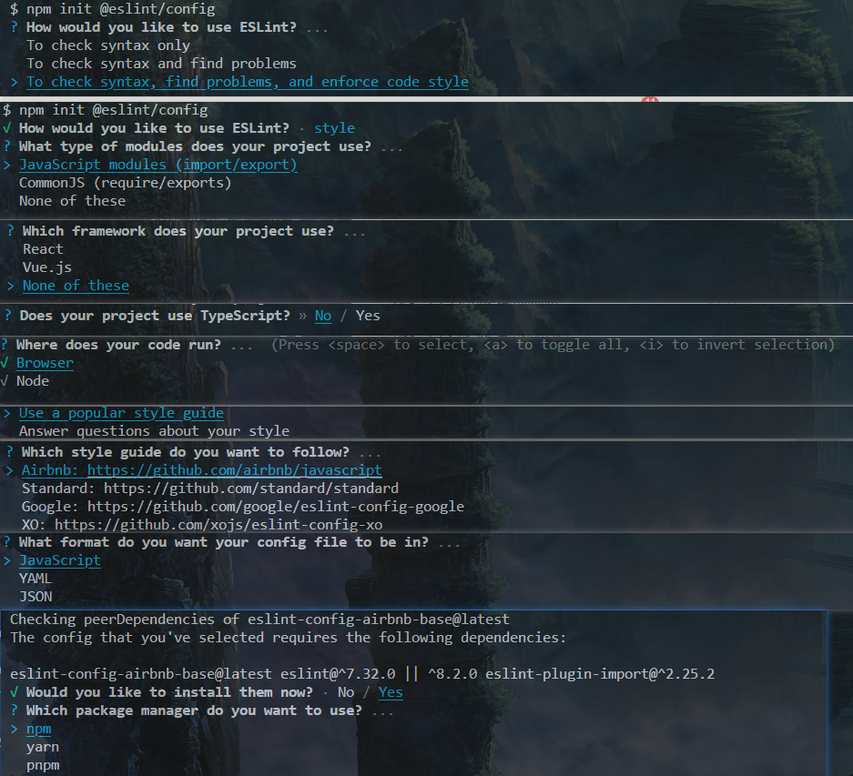
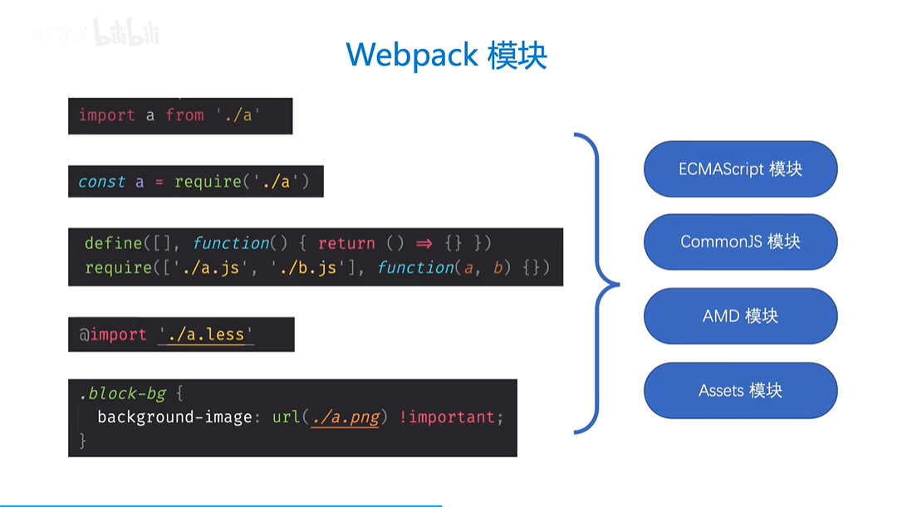
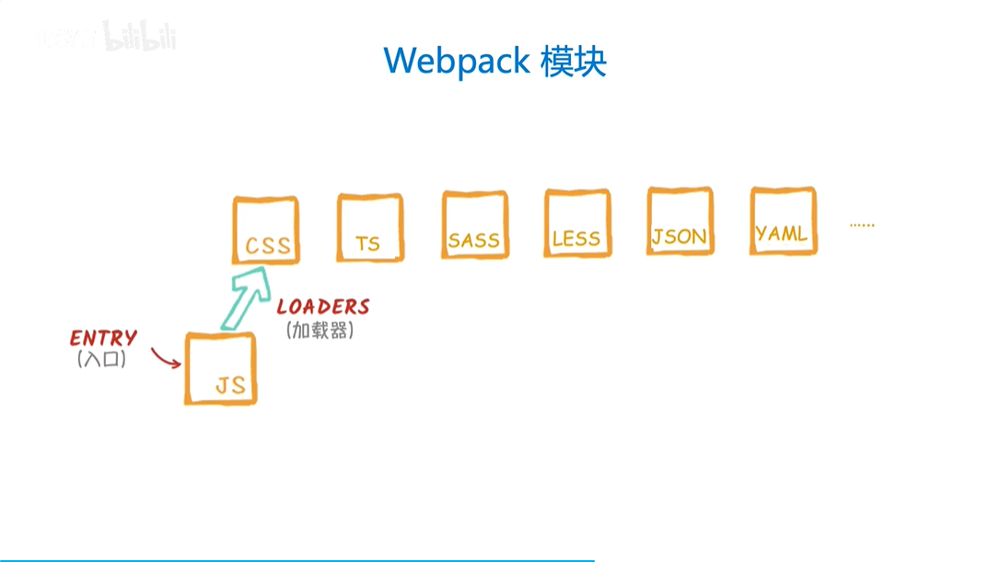
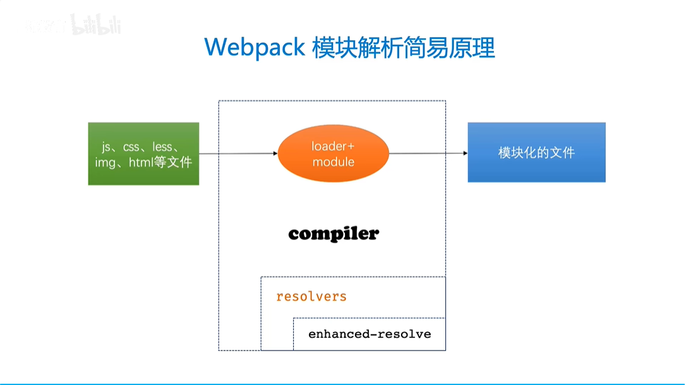
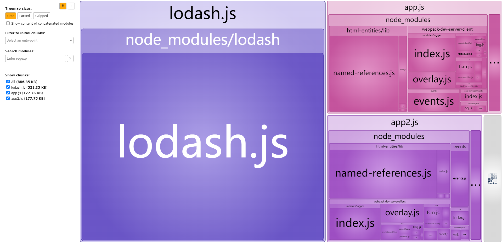
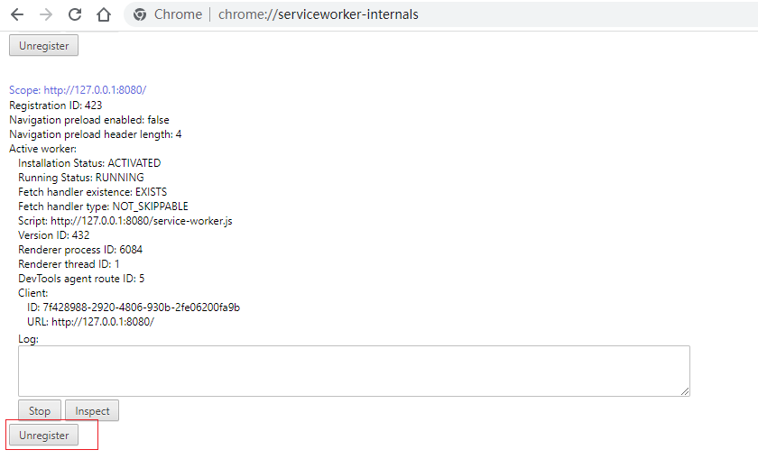

# frontend-webpack-learning

[TOC]

【Webpack】【未学完，但到了一定层度】

学习地址：

https://www.bilibili.com/video/BV1YU4y1g745/?p=79&spm_id_from=pageDriver&vd_source=b850b3a29a70c8eb888ce7dff776a5d1

学习地址2：

https://www.bilibili.com/video/BV14T4y1z7sw?p=53&vd_source=b850b3a29a70c8eb888ce7dff776a5d1

官网地址：

https://webpack.js.org/

# 一、前提

学习Webpack的前提是，你已经学会如下知识；

- HTML
- CSS
- JavaScript

- NodeJS

# 二、Webpack基础应用篇

<span style="color:blue;font-weight:bold;">各种基础配置项所对应的功能。</span>

## 1、初始化环境

### 1.1、初始化项目

打开终端，进入项目根目录（**注意：项目名不要与`webpack`同名**）。

**说明：**由于学习webpack会创建多个项目，为了避免重复安装，这里会在根目录`frontend-webpack-learning`初始化NodeJS项目。执行`npx webpack`时是到具体某个项目目录下，根据模块特性，多个项目会共享到最外层的webpack。

- 初始化`package.json`

```shell
$ npm init -y
```

### 1.2、安装Webpack

- 安装Webpack

```shell
$ npm i webpack webpack-cli -D
```

- 查看Webpack安装版本信息

```shell
$ npx webpack -v
```

- 查看打包细节

```shell
$ npx webpack --stats detailed
```

- 查看命令帮助

```shell
$ npx webpack -h
```

### 1.3、配置结构与执行命令

- 配置结构

创建配置文件`webpack.config.js`

```js
const path = require("path");
const HtmlWebpackPlugin = require("html-webpack-plugin");

module.exports = {
    // 默认值 ./src/index.js
    entry: "./src/index.js",
    // 默认值 ./dist/main.js
    output: {
        path: path.resolve(__dirname, "dist"),
        filename: "bundle.js",
        clean: true,
    },
    plugins: [
        // 默认值 ./dist/index.html
        new HtmlWebpackPlugin({
            template: "./index.html",
            filename: "app.html",
            inject: "body",
        }),
    ],
    mode: "development",
    devtool: "inline-source-map",
    devServer: {
        static: "./dist", // 服务资源目录
        host: "localhost", // 启动服务器域名
        port: "3000", // 启动服务器端口号
        // open: true, // 是否自动打开浏览器
        open: ["/app.html"], // 打开指定页面
        hot: true, // 开启HMR（Webpack5默认开启）功能（只能用于开发环境，生产环境不需要了）
    },
};
```

- 执行命令

```shell
$ npx webpack
```

- 执行监视命令

```shell
$ npx webpack --watch
# 或者
$ npx webpack -w
```

- 热更新启动

```shell
$ npx webpack-dev-server
# 或者
$ npx webpack serve
```

## 2、使用HtmlWebpackPlugin

- 安装

```shell
$ npm i html-webpack-plugin -D
```

- 配置`webpack.config.js`

```js
const HtmlWebpackPlugin = require("html-webpack-plugin");

module.exports = {
    // ......
    plugins: [
        // 默认值 ./dist/index.html
        new HtmlWebpackPlugin({
            template: "./index.html",
            filename: "app.html",
            inject: "body",
        }),
    ],
    // ......
};
```

## 3、使用SourceMapDevToolPlugin

https://webpack.js.org/configuration/devtool/#root

无需额外安装，配置`devtool`即可启用。

- 配置`webpack.config.js`

```js
module.exports = {
    // ......
    devtool: "inline-source-map",
    // ......
};
```

## 4、使用webpack-dev-server

`webpack-dev-server`为你提供了一个基本的web server，并且具有live reloading（实时重新加载）功能。

- 安装

```shell
$ npm i webpack-dev-server -D
```

- 配置`webpack.config.js`

```js
module.exports = {
    // ......
    devServer: {
        static: "./dist",
    },
    // ......
};
```

- 启动

启动后，该插件并未编译输出内容到dist，而是在内存里。

```shell
$ npx webpack-dev-server
# 或者
$ npx webpack serve
```

## 5、资源模块asset（含图片）

- asset/resource

  - 发送一个单独的文件并导出URL
  - 是否会打包到`dist`目录：是
  - 配置`webpack.config.js`

  ```js
  module.exports = {
      // ......
      output: {
          /*
           * 将图片文件输出到 static/imgs 目录中
           * 将图片文件命名 [hash:8][ext][query]
           * [hash:8]: hash值取8位
           * [ext]: 使用之前的文件扩展名
           * [query]: 添加之前的query参数
           */
          assetModuleFilename: "images/[contenthash][ext]",
      },
      // 加载器
      module: {
          rules: [
              {
                  test: /\.png$/,
                  type: "asset/resource",
                  generator: {
                      // 会覆盖 assetModuleFilename 的配置
                      filename: "images/[contenthash][ext]",
                  },
              },
          ],
      },
      // ......
  };
  
  ```

- asset/inline

  - 导出一个资源的Data URL
  - 是否会打包到`dist`目录：否
  - 配置`webpack.config.js`

  ```js
  const path = require("path");
  const HtmlWebpackPlugin = require("html-webpack-plugin");
  
  module.exports = {
      // ......
      output: {
          assetModuleFilename: "images/[contenthash][ext]",
      },
      // 加载器
      module: {
          rules: [
              {
                  test: /\.svg$/,
                  type: "asset/inline",
              },
          ],
      },
      // ......
  };
  ```

- asset/source

  - 导出资源的源代码
  - 是否会打包到`dist`目录：否
  - 配置`webpack.config.js`

  ```js
  module.exports = {
      // ......
      output: {
          assetModuleFilename: "images/[contenthash][ext]",
      },
      // 加载器
      module: {
          rules: [
              {
                  test: /\.txt$/,
                  type: "asset/source",
              },
          ],
      },
      // ......
  };
  ```

- asset

  - 导出一个Data URL(asset/inline)和发送一个单独的文件(asset/resource)之间自动选择。
  - 是否会打包到`dist`目录：不定
    - 默认小于8kb的文件，将会视为`inline`模块类型，否则会被视为`resource`模块类型。
    - 可以通过在webpack配置的module rule层级中，设置`Rule.parser.dataUrlCondition.maxSize`选项来修改此条件：

  - 配置`webpack.config.js`

  ```js
  module.exports = {
      // ......
      output: {
          assetModuleFilename: "images/[contenthash][ext]",
      },
      // 加载器
      module: {
          rules: [
              {
                  test: /\.jpg$/,
                  type: "asset",
                  parser: {
                      dataUrlCondition: {
                          maxSize: 4 * 1024 * 1024,
                      },
                  },
              },
          ],
      },
      // ......
  };
  ```

## 6、处理样式资源

### 6.1、处理css资源

- 安装
  - `css-loader`: 负责将 CSS 文件编译成 Webpack 能识别的模块
  - `style-loader`: 会动态创建一个 Style 标签，里面放置 Webpack 中 CSS 模块内容

```shell
$ npm i css-loader style-loader -D
```

- 配置

```js
module.exports = {
    // ......
    // 加载器
    module: {
        rules: [
            {
                test: /\.css$/,
                use: ["style-loader", "css-loader"], // 从后往前调用loader
            },
        ],
    },
	// ......
};
```

### 6.2、处理Less资源

http://lesscss.cn/

- 安装
  - `less-loader`: 负责将 Less 文件编译成 CSS 文件

```shell
$ npm i less less-loader -D
```

- 配置

```js
module.exports = {
    // ......
    // 加载器
    module: {
        rules: [
            {
                test: /\.(css|less)$/,
                use: ["style-loader", "css-loader", "less-loader"], // 从后往前调用loader
            },
        ],
    },
	// ......
};
```

### 6.3、处理Sass资源

https://www.sass.hk/

- 安装
  - `sass-loader`: 负责将 Sass 文件编译成 CSS 文件
  - `sass`: `sass-loader`依赖`sass`进行编译

```shell
$ npm i sass-loader sass -D
```

- 配置

```js
module.exports = {
    // ......
    // 加载器
    module: {
        rules: [
            {
                test: /\.s[ac]ss$/,
                use: ["style-loader", "css-loader", "sass-loader"], // 从后往前调用loader
            },
        ],
    },
	// ......
};
```

### 6.4、处理Styl资源

https://stylus.bootcss.com/

- 安装	
  - `stylus-loader`: 负责将Styl文件编译成CSS文件。

```shell
$ npm i stylus-loader -D
```

- 配置

```js
module.exports = {
    // ......
    // 加载器
    module: {
        rules: [
            {
                test: /\.styl$/,
                use: ["style-loader", "css-loader", "stylus-loader"], // 从后往前调用loader
            },
        ],
    },
	// ......
};
```

### 6.5、抽离和压缩CSS

- 安装

  - 抽离CSS

  ```shell
  $ npm i mini-css-extract-plugin -D
  ```

  - 压缩CSS
    - 注意：压缩插件要在`mode=production`模式下使用

  ```shell
  $ npm i css-minimizer-webpack-plugin -D
  ```

- 配置

```js
const MiniCssExtractPlugin = require("mini-css-extract-plugin");
const CssMinimizerWebpackPlugin = require("css-minimizer-webpack-plugin");

module.exports = {
	// ......
    // 加载器
    module: {
        rules: [
            {
                test: /\.(css|less)$/,
                use: [MiniCssExtractPlugin.loader, "css-loader", "less-loader"], // 从后往前调用loader
            },
            {
                test: /\.s[ac]ss$/,
                use: [MiniCssExtractPlugin.loader, "css-loader", "sass-loader"], // 从后往前调用loader
            },
            {
                test: /\.styl$/,
                use: [
                    MiniCssExtractPlugin.loader,
                    "css-loader",
                    "stylus-loader",
                ], // 从后往前调用loader
            },
        ],
    },
    plugins: [
        // 抽离CSS
        new MiniCssExtractPlugin({
            // 定义输出文件名和目录
            filename: "styles/[contenthash].css",
        }),
    ],
    optimization: {
        minimizer: [
            // 压缩CSS
            new CssMinimizerWebpackPlugin({}),
        ],
    },
    // mode: "development",
    mode: "production",
};
```

### 6.6、CSS兼容性处理

- 安装

```shell
$ npm i postcss-loader postcss postcss-preset-env -D
```

- 配置

```js
const MiniCssExtractPlugin = require("mini-css-extract-plugin");

module.exports = {
	// ......
    // 加载器
    module: {
        rules: [
            {
                test: /\.(css|less)$/,
                use: [
                    MiniCssExtractPlugin.loader,
                    "css-loader",
                    {
                        loader: "postcss-loader",
                        options: {
                            postcssOptions: {
                                plugins: [
                                    "postcss-preset-env", // 能解决大多数样式兼容性问题
                                ],
                            },
                        },
                    },
                    "less-loader",
                ], // 从后往前调用loader
            },
            {
                test: /\.s[ac]ss$/,
                use: [
                    MiniCssExtractPlugin.loader,
                    "css-loader",
                    {
                        loader: "postcss-loader",
                        options: {
                            postcssOptions: {
                                plugins: [
                                    "postcss-preset-env", // 能解决大多数样式兼容性问题
                                ],
                            },
                        },
                    },
                    "sass-loader",
                ], // 从后往前调用loader
            },
            {
                test: /\.styl$/,
                use: [
                    MiniCssExtractPlugin.loader,
                    "css-loader",
                    {
                        loader: "postcss-loader",
                        options: {
                            postcssOptions: {
                                plugins: [
                                    "postcss-preset-env", // 能解决大多数样式兼容性问题
                                ],
                            },
                        },
                    },
                    "stylus-loader",
                ], // 从后往前调用loader
            },
        ],
    },
	// ......
};
```

- 简化配置

```js
const MiniCssExtractPlugin = require("mini-css-extract-plugin");

// 获取处理样式的Loaders
const getCSSLoaders = (preProcessor) => {
    return [
        MiniCssExtractPlugin.loader,
        "css-loader",
        {
            loader: "postcss-loader",
            options: {
                postcssOptions: {
                    plugins: [
                        "postcss-preset-env", // 能解决大多数样式兼容性问题
                    ],
                },
            },
        },
        preProcessor,
    ].filter(Boolean);
};

module.exports = {
	// ......
    // 加载器
    module: {
        rules: [
            {
                test: /\.(css|less)$/,
                use: getCSSLoaders("less-loader"), // 从后往前调用loader
            },
            {
                test: /\.s[ac]ss$/,
                use: getCSSLoaders("sass-loader"), // 从后往前调用loader
            },
            {
                test: /\.styl$/,
                use: getCSSLoaders("stylus-loader"), // 从后往前调用loader
            },
        ],
    },
	// ......
};
```

## 7、加载图片资源

过去在 Webpack4 时，我们处理图片资源通过 `file-loader` 和 `url-loader` 进行处理

现在 Webpack5 已经将两个 Loader 功能内置到 Webpack 里了，我们只需要简单配置即可处理图片资源

**参见“资源模块asset（含图片）”章节。**

## 8、加载fonts字体

- 下载字体图标文件

  - [打开阿里巴巴矢量图标库](https://www.iconfont.cn/)

  - 选择想要的图标添加到购物车，统一下载到本地

- 配置

```js
module.exports = {
    // ......
    output: {
        assetModuleFilename: "images/[contenthash][ext]",
    },
    // 加载器
    module: {
        rules: [
            {
                test: /\.(woff?|eot|ttf|otf)$/,
                type: "asset/resource",
            },
        ],
    },
	// ......
};
```


## 9、加载其他数据资源

JS、CSS、图片等之外的其他数据资源，比如JSON文件、CSV、TSV和XML、音频、视频等。其中JSON是内置的，无需额外配置。

- 加载音频、视频

```js
module.exports = {
    // ......
    output: {
        assetModuleFilename: "images/[contenthash][ext]",
    },
    // 加载器
    module: {
        rules: [
            {
                test: /\.(mp3|mp4|avi)$/,
                type: "asset/resource",
            },
        ],
    },
	// ......
};
```

- 导入CSV、TSV和XML，可以使用`csv-loader`和`xml-loader`。

  - 安装

  ```shell
  $ npm i csv-loader xml-loader -D
  ```

  - 配置

  ```js
  module.exports = {
      // ......
      // 加载器
      module: {
          rules: [
              {
                  test: /\.(csv|tsv)$/,
                  use: "csv-loader",
              },
              {
                  test: /\.xml$/,
                  use: "xml-loader",
              },
          ],
      },
  	// ......
  };
  ```

## 10、自定义JSON模块parser

- 安装

```shell
$ npm i toml yaml json5 -D
```

- 配置

```js
const toml = require("toml");
const yaml = require("yaml");
const json5 = require("json5");

module.exports = {
    // ......
    // 加载器
    module: {
        rules: [
            {
                test: /\.toml$/,
                type: "json",
                parser: {
                    parse: toml.parse,
                },
            },
            {
                test: /\.yaml$/,
                type: "json",
                parser: {
                    parse: yaml.parse,
                },
            },
            {
                test: /\.json5$/,
                type: "json",
                parser: {
                    parse: json5.parse,
                },
            },
        ],
    },
	// ......
};
```

## 11、使用babel-loader

- 安装
  - `babel-loader`: 在webpack里应用babel解析ES6的巧了
  - `@babel/core`: babel核心模块
  - `@babel/preset-env`: babel预设，一组babel插件的集合

```shell
$ npm i babel-loader @babel/core @babel/preset-env -D
```

- 辅助安装（报错regeneratorRuntime的解决办法，<span style="color:red;font-weight:bold;">我执行并未报错</span>）
  - `regeneratorRuntime`是webpack打包生成的全局辅助函数，由babel生成，用于兼容async/await的语法。

```shell
# 这个包中包含了 regeneratorRuntime，运行时需要
$ npm i @babel/runtime -D
# 这个插件会在需要regeneratorRuntime的地方自动require导包，编译时需要
$ npm i @babel/plugin-transform-runtime -D
# 更多参考 https://babeljs.io/docs/en/babel-plugin-transform-runtime
```

- 配置

```js
module.exports = {
    // ......
    // 加载器
    module: {
        rules: [
            {
                test: /\.js$/,
                exclude: /node_modules/,
                use: {
                    loader: "babel-loader",
                    options: {
                        presets: ["@babel/preset-env"],
                        plugins: [["@babel/plugin-transform-runtime"]],
                    },
                },
            },
        ],
    },
    // ......
};
```

## 12、代码分离

### 12.1、常用的代码分离方法

- 配置入口起点
  - 使用entry配置手动地分离代码。
  - 缺点：
    - 如果有多个入口，那么这些多个入口共享的文件，会<span style="color:red;font-weight:bold;">分别在每个包里面去重复打包</span>。
- 防止重复的方法
  - 使用Entry dependencies或者SplitChunksPlugin去重和分离代码。
- 动态导入
  - 通过模块的内联函数调用来分离代码。

### 12.2、入口起点法

这是迄今为止最简单直观的分离代码的方式。不过，这种方式手动配置较多，并有一些隐患，我们将会解决这些问题。

先来看看如何从main bundle中分离another module（另一个模块）：

- 配置

```js
const path = require("path");
module.exports = {
    // ......
    // 默认值 ./src/index.js
    entry: {
        index: "./src/index.js",
        another: "./src/another-module.js",
    },
    // 默认值 ./dist/main.js
    output: {
        path: path.resolve(__dirname, "dist"),
        filename: "[name].bundle.js",
    },
    // ......
};
```

### 12.3、解决入口起点法的重复问题

- 使用Entry dependencies去除重复

```js
const path = require("path");
module.exports = {
    // ......
    // 默认值 ./src/index.js
    entry: {
        index: {
            import: "./src/index.js",
            dependOn: "shared",
        },
        another: {
            import: "./src/another-module.js",
            dependOn: "shared",
        },
        shared: "lodash",
    },
    // 默认值 ./dist/main.js
    output: {
        path: path.resolve(__dirname, "dist"),
        filename: "[name].bundle.js",
    },
    // ......
};
```

- 使用SplitChunksPlugin去重

```js
const path = require("path");
module.exports = {
    // ......
    // 默认值 ./src/index.js
    entry: {
        index: "./src/index.js",
        another: "./src/another-module.js",
    },
    // 默认值 ./dist/main.js
    output: {
        path: path.resolve(__dirname, "dist"),
        filename: "[name].bundle.js",
    },
    optimization: {
        splitChunks: {
            chunks: "all",
        },
    }
    // ......
};
```

### 12.4、动态导入

- 代码

```js
function getComponent() {
    return import("lodash").then(({ default: _ }) => {
        const element = document.createElement("div");
        element.innerHTML = _.join(["Hello", "webpack"], " ");
        return element;
    });
}

getComponent().then((element) => {
    document.body.appendChild(element);
});
```

- 引入到入口

```js
import "./async-module";
```

### 12.5、总结

多入口时，使用SplitChunksPlugin去重和动态导入可以完美并存。

## 13、懒加载

懒加载或者按需加载，是一种很好的优化网页或应用的方式。这种方式实际上是先把你的代码在一些逻辑断点处分离开，然后在一些代码块中万次某些操作后，立即引用或即将引用另外一些新的代码块。这样加快了应用的初始加载速度，减轻了它的总体的体积，因为某些代码块可能永远不会被加载。

- math.js

```js
export const add = (x, y) => {
    return x + y;
};

export const minus = (x, y) => {
    return x - y;
};
```

- 懒加载引用

```js
const button = document.createElement("button");
button.textContent = "点击执行加法运算";
button.addEventListener("click", () => {
    // 通过指定名称，不再得到 src_math_js.bundle.js 而是 math.bundle.js
    import(/* webpackChunkName: 'math' */ "./math").then(({ add }) => {
        console.log(add(4, 5));
    });
});
document.body.appendChild(button);
```

## 14、预获取/预加载模块

Webpack v4.6.0+ 增加了对预获取和预加载的支持。

在声明import时，使用下面这些内置指令，可以让webpack输出“resource hint（资源提示）”，来告知浏览器：

- **prefetch(预获取)**：将来某些导航下可能需要的资源。
- **preload(预加载)**: 当前导航下可能需要资源。

```js
const button = document.createElement("button");
button.textContent = "点击执行加法运算";
button.addEventListener("click", () => {
    // 通过指定名称，不再得到 src_math_js.bundle.js 而是 math.bundle.js
    /**
     * webpackPrefetch: true 在空闲时，实际调用之前，可以预先加载
     * webpackPreload: true 预加载，与懒加载一样，没有预获取 webpackPrefetch 好
     */
    import(/* webpackChunkName: 'math', webpackPreload: true */ "./math").then(
        ({ add }) => {
            console.log(add(4, 5));
        }
    );
});
document.body.appendChild(button);
```

## 15、缓存本地JS(输出文件的文件名)

- 配置

```js
module.exports = {
    // ......
    // 默认值 ./dist/main.js
    output: {
	    // ......
        filename: "[name].[contenthash].js",
	    // ......
    },
    // ......
};
```

## 16、缓存第三方库

- 配置

```js
module.exports = {
    // ......
    // 默认值 ./dist/main.js
    output: {
	    // ......
		filename: "scripts/[name].[contenthash].js",
	    // ......
    },
    // ......
    optimization: {
	    // ......
        splitChunks: {
            cacheGroups: {
                vendor: {
                    test: /[\\/]node_modules[\\/]/,
                    name: "vendors",
                    chunks: "all",
                },
            },
        },
    },
    // ......
};
```

## 17、公共路径

html引入资源时，自动添加公共路径。

- 配置

```js
module.exports = {
    // ......
    // 默认值 ./dist/main.js
    output: {
        publicPath: "http://localhost:8080/",
    },
    // ......
};
```

## 18、环境变量【杂乱】

想要消除`webpack.config.js`在<span style="color:green;font-weight:bold;">开发环境</span>和<span style="color:green;font-weight:bold;">生产环境</span>之间的差异，你可能需要环境变量(environment variable)。

webpack命令行<span style="color:green;font-weight:bold;">环境配置</span>的`--env`参数，可以允许你传入任意数量的环境变量。而在`webpack.config.js`中可用访问到这些环境变量。例如：`--env production`或`--env goal=local`。

```shell
$ npx webpack --env goal=local --env production --progress
```

对于我们的webpack配置，有一个必须要修改之处。通常，`module.exports`指向配置对象。要使用`env`变量，你必须将`module.exports`转换成一个函数：

- 压缩插件

配置的CssMinimizerWebpackPlugin导致js压缩失效了，安装插件

```shell
$ npm i terser-webpack-plugin -D
```

- 配置

```js
const CssMinimizerWebpackPlugin = require("css-minimizer-webpack-plugin");
const TerserWebpackPlugin = require("terser-webpack-plugin");

module.exports = (env) => {
    console.log(env);
    return {
        // ......
        optimization: {
            minimizer: [
                // 压缩CSS
                new CssMinimizerWebpackPlugin({}),
                // 压缩JS
                new TerserWebpackPlugin(),
            ],
			// ......
        },
        mode: env.production ? "production" : "development",
        // ......
    };
};
```

- 执行命令

```shell
$ npx webpack --env production --env goal=local
```

## 19、拆分配置文件【清晰臃肿，过渡】

### 19.1、开发配置

- `webpack.config.dev.js`配置

```js
const path = require("path");
const HtmlWebpackPlugin = require("html-webpack-plugin");
const MiniCssExtractPlugin = require("mini-css-extract-plugin");

const toml = require("toml");
const yaml = require("yaml");
const json5 = require("json5");

// 获取处理样式的Loaders
const getCSSLoaders = (preProcessor) => {
    return [
        MiniCssExtractPlugin.loader,
        "css-loader",
        {
            loader: "postcss-loader",
            options: {
                postcssOptions: {
                    plugins: [
                        "postcss-preset-env", // 能解决大多数样式兼容性问题
                    ],
                },
            },
        },
        preProcessor,
    ].filter(Boolean);
};

module.exports = {
    // 默认值 ./src/index.js
    entry: {
        index: "./src/index.js",
        another: "./src/another-module.js",
    },
    // 默认值 ./dist/main.js
    output: {
        path: path.resolve(__dirname, "../dist"),
        filename: "scripts/[name].js",
        clean: true,
        assetModuleFilename: "images/[contenthash][ext]",
    },
    // 加载器
    module: {
        rules: [
            {
                test: /\.png$/,
                type: "asset/resource",
                generator: {
                    // 会覆盖 assetModuleFilename 的配置
                    filename: "images/[contenthash][ext]",
                },
            },
            {
                test: /\.svg$/,
                type: "asset/inline",
            },
            {
                test: /\.txt$/,
                type: "asset/source",
            },
            {
                test: /\.jpg$/,
                type: "asset",
                parser: {
                    dataUrlCondition: {
                        maxSize: 4 * 1024 * 1024,
                    },
                },
            },
            {
                test: /\.(css|less)$/,
                use: getCSSLoaders("less-loader"), // 从后往前调用loader
            },
            {
                test: /\.s[ac]ss$/,
                use: getCSSLoaders("sass-loader"), // 从后往前调用loader
            },
            {
                test: /\.styl$/,
                use: getCSSLoaders("stylus-loader"), // 从后往前调用loader
            },
            {
                test: /\.(woff?|eot|ttf|otf)$/,
                type: "asset/resource",
            },
            {
                test: /\.(csv|tsv)$/,
                use: "csv-loader",
            },
            {
                test: /\.xml$/,
                use: "xml-loader",
            },
            {
                test: /\.toml$/,
                type: "json",
                parser: {
                    parse: toml.parse,
                },
            },
            {
                test: /\.yaml$/,
                type: "json",
                parser: {
                    parse: yaml.parse,
                },
            },
            {
                test: /\.json5$/,
                type: "json",
                parser: {
                    parse: json5.parse,
                },
            },
            {
                test: /\.js$/,
                exclude: /node_modules/,
                use: {
                    loader: "babel-loader",
                    options: {
                        presets: ["@babel/preset-env"],
                        plugins: [["@babel/plugin-transform-runtime"]],
                    },
                },
            },
        ],
    },
    plugins: [
        // 默认值 ./dist/index.html
        new HtmlWebpackPlugin({
            template: "./index.html",
            filename: "app.html",
            inject: "body",
        }),
        // 抽离CSS
        new MiniCssExtractPlugin({
            // 定义输出文件名和目录
            filename: "styles/[contenthash].css",
        }),
    ],
    optimization: {
        splitChunks: {
            cacheGroups: {
                vendor: {
                    test: /[\\/]node_modules[\\/]/,
                    name: "vendors",
                    chunks: "all",
                },
            },
        },
    },
    mode: "development",
    devtool: "inline-source-map", // 也可以选用 cheap-module-source-map
    devServer: {
        // static: "./dist", // 服务资源目录
        host: "localhost", // 启动服务器域名
        port: "3000", // 启动服务器端口号
        // open: true, // 是否自动打开浏览器
        open: ["/app.html"], // 打开指定页面
        hot: true, // 开启HMR（Webpack5默认开启）功能（只能用于开发环境，生产环境不需要了）
    },
};
```

- 执行命令

```shell
$ npx webpack --config ./config/webpack.config.dev.js
# 或者
$ npx webpack -c ./config/webpack.config.dev.js
```

- 执行开发启动

```shell
# 不会输出到dist，而是在内存中
$ npx webpack serve -c ./config/webpack.config.dev.js
```

### 19.2、生产配置

- `webpack.config.prod.js`配置

```js
const path = require("path");
const HtmlWebpackPlugin = require("html-webpack-plugin");
const MiniCssExtractPlugin = require("mini-css-extract-plugin");
const CssMinimizerWebpackPlugin = require("css-minimizer-webpack-plugin");
const TerserWebpackPlugin = require("terser-webpack-plugin");

const toml = require("toml");
const yaml = require("yaml");
const json5 = require("json5");

// 获取处理样式的Loaders
const getCSSLoaders = (preProcessor) => {
    return [
        MiniCssExtractPlugin.loader,
        "css-loader",
        {
            loader: "postcss-loader",
            options: {
                postcssOptions: {
                    plugins: [
                        "postcss-preset-env", // 能解决大多数样式兼容性问题
                    ],
                },
            },
        },
        preProcessor,
    ].filter(Boolean);
};

module.exports = {
    // 默认值 ./src/index.js
    entry: {
        index: "./src/index.js",
        another: "./src/another-module.js",
    },
    // 默认值 ./dist/main.js
    output: {
        path: path.resolve(__dirname, "../dist"),
        filename: "scripts/[name].[contenthash].js",
        clean: true,
        assetModuleFilename: "images/[contenthash][ext]",
        publicPath: "http://localhost:8080/",
    },
    // 加载器
    module: {
        rules: [
            {
                test: /\.png$/,
                type: "asset/resource",
                generator: {
                    // 会覆盖 assetModuleFilename 的配置
                    filename: "images/[contenthash][ext]",
                },
            },
            {
                test: /\.svg$/,
                type: "asset/inline",
            },
            {
                test: /\.txt$/,
                type: "asset/source",
            },
            {
                test: /\.jpg$/,
                type: "asset",
                parser: {
                    dataUrlCondition: {
                        maxSize: 4 * 1024 * 1024,
                    },
                },
            },
            {
                test: /\.(css|less)$/,
                use: getCSSLoaders("less-loader"), // 从后往前调用loader
            },
            {
                test: /\.s[ac]ss$/,
                use: getCSSLoaders("sass-loader"), // 从后往前调用loader
            },
            {
                test: /\.styl$/,
                use: getCSSLoaders("stylus-loader"), // 从后往前调用loader
            },
            {
                test: /\.(woff?|eot|ttf|otf)$/,
                type: "asset/resource",
            },
            {
                test: /\.(csv|tsv)$/,
                use: "csv-loader",
            },
            {
                test: /\.xml$/,
                use: "xml-loader",
            },
            {
                test: /\.toml$/,
                type: "json",
                parser: {
                    parse: toml.parse,
                },
            },
            {
                test: /\.yaml$/,
                type: "json",
                parser: {
                    parse: yaml.parse,
                },
            },
            {
                test: /\.json5$/,
                type: "json",
                parser: {
                    parse: json5.parse,
                },
            },
            {
                test: /\.js$/,
                exclude: /node_modules/,
                use: {
                    loader: "babel-loader",
                    options: {
                        presets: ["@babel/preset-env"],
                        plugins: [["@babel/plugin-transform-runtime"]],
                    },
                },
            },
        ],
    },
    plugins: [
        // 默认值 ./dist/index.html
        new HtmlWebpackPlugin({
            template: "./index.html",
            filename: "app.html",
            inject: "body",
        }),
        // 抽离CSS
        new MiniCssExtractPlugin({
            // 定义输出文件名和目录
            filename: "styles/[contenthash].css",
        }),
    ],
    optimization: {
        minimizer: [
            // 压缩CSS
            new CssMinimizerWebpackPlugin({}),
            // 压缩JS
            new TerserWebpackPlugin(),
        ],
        splitChunks: {
            cacheGroups: {
                vendor: {
                    test: /[\\/]node_modules[\\/]/,
                    name: "vendors",
                    chunks: "all",
                },
            },
        },
    },
    mode: "production",
    devtool: "source-map",
    // 解决生产环境下编译提示：The following asset(s) exceed the recommended size limit (244 KiB)
    performance: {
        hints: false,
    },
};
```

- 执行命令

```shell
$ npx webpack --config ./config/webpack.config.prod.js
# 或者
$ npx webpack -c ./config/webpack.config.prod.js
```


## 20、npm脚本

- package.json

```json
{
    "scripts": {
        "test": "echo \"Error: no test specified\" && exit 1",
        "start": "webpack serve -c ./config/webpack.config.dev.js",
        "build": "webpack -c ./config/webpack.config.prod.js"
    },
}
```

- 执行命令

```shell
# 开发
$ npm run start
# 或者
$ npm start

# 生产
$ npm run build
```

## 21、提取公共配置及合并配置【推荐】

### 21.1、安装合并工具

- 安装

```shell
$ npm i webpack-merge -D
```

### 21.2、提取公共配置

- webpack.config.common.js

```js
const path = require("path");
const HtmlWebpackPlugin = require("html-webpack-plugin");
const MiniCssExtractPlugin = require("mini-css-extract-plugin");
const CssMinimizerWebpackPlugin = require("css-minimizer-webpack-plugin");
const TerserWebpackPlugin = require("terser-webpack-plugin");

const toml = require("toml");
const yaml = require("yaml");
const json5 = require("json5");

// 获取处理样式的Loaders
const getCSSLoaders = (preProcessor) => {
    return [
        MiniCssExtractPlugin.loader,
        "css-loader",
        {
            loader: "postcss-loader",
            options: {
                postcssOptions: {
                    plugins: [
                        "postcss-preset-env", // 能解决大多数样式兼容性问题
                    ],
                },
            },
        },
        preProcessor,
    ].filter(Boolean);
};

module.exports = {
    // 默认值 ./src/index.js
    entry: {
        index: "./src/index.js",
        another: "./src/another-module.js",
    },
    // 默认值 ./dist/main.js
    output: {
        path: path.resolve(__dirname, "../dist"),
        // filename: "scripts/[name].[contenthash].js",
        clean: true,
        assetModuleFilename: "images/[contenthash][ext]",
        // publicPath: "http://localhost:8080/",
    },
    // 加载器
    module: {
        rules: [
            {
                test: /\.png$/,
                type: "asset/resource",
                generator: {
                    // 会覆盖 assetModuleFilename 的配置
                    filename: "images/[contenthash][ext]",
                },
            },
            {
                test: /\.svg$/,
                type: "asset/inline",
            },
            {
                test: /\.txt$/,
                type: "asset/source",
            },
            {
                test: /\.jpg$/,
                type: "asset",
                parser: {
                    dataUrlCondition: {
                        maxSize: 4 * 1024 * 1024,
                    },
                },
            },
            {
                test: /\.(css|less)$/,
                use: getCSSLoaders("less-loader"), // 从后往前调用loader
            },
            {
                test: /\.s[ac]ss$/,
                use: getCSSLoaders("sass-loader"), // 从后往前调用loader
            },
            {
                test: /\.styl$/,
                use: getCSSLoaders("stylus-loader"), // 从后往前调用loader
            },
            {
                test: /\.(woff?|eot|ttf|otf)$/,
                type: "asset/resource",
            },
            {
                test: /\.(csv|tsv)$/,
                use: "csv-loader",
            },
            {
                test: /\.xml$/,
                use: "xml-loader",
            },
            {
                test: /\.toml$/,
                type: "json",
                parser: {
                    parse: toml.parse,
                },
            },
            {
                test: /\.yaml$/,
                type: "json",
                parser: {
                    parse: yaml.parse,
                },
            },
            {
                test: /\.json5$/,
                type: "json",
                parser: {
                    parse: json5.parse,
                },
            },
            {
                test: /\.js$/,
                exclude: /node_modules/,
                use: {
                    loader: "babel-loader",
                    options: {
                        presets: ["@babel/preset-env"],
                        plugins: [["@babel/plugin-transform-runtime"]],
                    },
                },
            },
        ],
    },
    plugins: [
        // 默认值 ./dist/index.html
        new HtmlWebpackPlugin({
            template: "./index.html",
            filename: "app.html",
            inject: "body",
        }),
        // 抽离CSS
        new MiniCssExtractPlugin({
            // 定义输出文件名和目录
            filename: "styles/[contenthash].css",
        }),
    ],
    optimization: {
        // minimizer: [
        //     // 压缩CSS
        //     new CssMinimizerWebpackPlugin({}),
        //     // 压缩JS
        //     new TerserWebpackPlugin(),
        // ],
        splitChunks: {
            cacheGroups: {
                vendor: {
                    test: /[\\/]node_modules[\\/]/,
                    name: "vendors",
                    chunks: "all",
                },
            },
        },
    },
    // mode: env.production ? "production" : "development",
    // devtool: "inline-source-map",
    // devServer: {
    //     // static: "./dist", // 服务资源目录
    //     host: "localhost", // 启动服务器域名
    //     port: "3000", // 启动服务器端口号
    //     // open: true, // 是否自动打开浏览器
    //     open: ["/app.html"], // 打开指定页面
    //     hot: true, // 开启HMR（Webpack5默认开启）功能（只能用于开发环境，生产环境不需要了）
    // },
};
```

### 21.3、补充dev配置

- webpack.config.dev.js

```js
module.exports = {
    // 默认值 ./dist/main.js
    output: {
        filename: "scripts/[name].js",
    },
    mode: "development",
    devtool: "inline-source-map", // 也可以选用 cheap-module-source-map
    devServer: {
        // static: "./dist", // 服务资源目录
        host: "localhost", // 启动服务器域名
        port: "3000", // 启动服务器端口号
        // open: true, // 是否自动打开浏览器
        open: ["/app.html"], // 打开指定页面
        hot: true, // 开启HMR（Webpack5默认开启）功能（只能用于开发环境，生产环境不需要了）
    },
};
```

### 21.4、补充prod配置

- webpack.config.prod.js

```js
const CssMinimizerWebpackPlugin = require("css-minimizer-webpack-plugin");
const TerserWebpackPlugin = require("terser-webpack-plugin");

module.exports = {
    // 默认值 ./dist/main.js
    output: {
        filename: "scripts/[name].[contenthash].js",
        publicPath: "http://localhost:8080/",
    },
    optimization: {
        minimizer: [
            // 压缩CSS
            new CssMinimizerWebpackPlugin({}),
            // 压缩JS
            new TerserWebpackPlugin(),
        ],
    },
    mode: "production",
    devtool: "source-map",
    // 解决生产环境下编译提示：The following asset(s) exceed the recommended size limit (244 KiB)
    performance: {
        hints: false,
    },
};
```

### 21.5、合并

```js
const { merge } = require("webpack-merge");

const commonConfig = require("./webpack.config.common");
const productionConfig = require("./webpack.config.prod");
const developmentConfig = require("./webpack.config.dev");

module.exports = (env) => {
    switch (true) {
        case env.development:
            return merge(commonConfig, developmentConfig);
        case env.production:
            return merge(commonConfig, productionConfig);
        default:
            return new Error("No matching configuration was found!");
    }
};
```

### 21.6、执行命令

- package.json

```json
{
    "scripts": {
        "test": "echo \"Error: no test specified\" && exit 1",
        "start": "npx webpack serve -c ./config/webpack.config.js --env development",
        "build": "npx webpack -c ./config/webpack.config.js --env production"
    },
}
```

- 执行命令

```shell
# 开发
$ npm run start
# 或者
$ npm start

# 生产
$ npm run build
```


# 三、Webpack高级应用篇

<span style="color:red;font-weight:bold;">分析Webpack的配置项，掌握定制项目配置的手段。</span>

## 提高开发效率与完善团队开发规范

## 1、source-map

https://webpack.js.org/configuration/devtool/#root

| 模式                    | 生产 | 解释                                                         |
| ----------------------- | ---- | ------------------------------------------------------------ |
| eval                    | no   | 【默认】每个module会封装到eval里面包裹起来执行，并且会在末尾追加注释//@ sourceURL. |
| source-map              | yes  | 生成一个SourceMap文件.【推荐生产环境使用】                   |
| hidden-source-map       | yes  | 和source-map一样，但不会在bundle末尾追加注释.                |
| inline-source-map       | no   | 生成一个DataUrl形式的SourceMap文件.                          |
| eval-source-map         | no   | 每个module会通过eval()来执行，并且生成一个DataUrl形式的SourceMap. |
| cheap-source-map        | no   | 生成一个没有列信息(column-mappings)的SourceMaps文件，不包含loader的sourcemap（譬如babel的sourcemap） |
| cheap-module-source-map | no   | 生成一个没有列信息(column-mappings)的SourceMaps文件，同时loader的sourcemap也被简化为只包含对应行的.【推荐开发环境使用】 |

要注意的是，生产环境我们一般不会开启sourcemap功能，主要有两点原因：

1. 通过bundle和sourcemap文件，可以反编译出源码——也就是说，线上产物有sourcemap文件的话，就意味着有暴露源码的风险。
2. 我们可以观察到，sourcemap文件的体积相对比较巨大，这跟我们生产环境的追求不同（生产环境追求更小更轻量的bundle）。

- 安装

```shell
$ npm i webpack webpack-cli webpack-dev-server html-webpack-plugin babel-loader @babel/core @babel/preset-env -D
```

> 一道思考题：有时候我们期望能第一时间通过线上的错误消息，来追踪到源码位置，从而快速解决掉bug以减轻损失。但又不希望sourcemap文件暴露在生产环境，有比较好的方案吗？

## 2、devServer

开发环境下，我们往往需要启动一个web服务，方便我们模拟一个用户从浏览器中访问我们的web服务，读取我们的打包产物，以观测我们的代码在客户端的表现。webpack内置了这样的功能，我们只需要简单的配置就可以开启它。

在此之前，我们需要安装它。

- 安装

```shell
$ npm i webpack webpack-cli webpack-dev-server html-webpack-plugin -D
```

devServer.proxy基于强大的中间件`http-proxy-middleware`实现的，因此它支持很多的配置项，我们基于此，可以做应对绝大多数开发场景的定制化配置。

- 配置

```js
const path = require("path");
const HtmlWebpackPlugin = require("html-webpack-plugin");

module.exports = {
    mode: "development",
    devtool: "cheap-module-source-map",
    entry: "./app.js",
    output: { clean: true, publicPath: "/" },
    module: {},
    plugins: [new HtmlWebpackPlugin()],
    devServer: {
        static: path.resolve(__dirname, "./dist"), // 定义一个目录用于存放静态文件
        compress: true, // 启用gzip压缩
        host: "0.0.0.0",
        port: 3000,
        open: true, // 是否自动打开浏览器
        // open: ["/index.html"], // 打开指定页面
        headers: {
            "X-Access-Token": "abc123",
        },
        proxy: {
            // 访问 /api/** 接口时会被代理到 http://localhost:9000/api/**
            "/api": "http://localhost:9000",
        },
        // https: true, // 开启 https 但是没有证书
        http2: true, // 开启 https 包含默认证书
        historyApiFallback: true, // 访问到不存在的路径时降级兼容而不是报错，同时需要 output.publicPath='/'
    },
};

```

## 3、模块热替换与热加载(HMR-HotModuleReplacementPlugin)

Webpack5已经自动加载该插件。

- 安装

```shell
$ npm i webpack webpack-cli webpack-dev-server html-webpack-plugin style-loader css-loader -D
```

- 配置

```js
const path = require("path");
const HtmlWebpackPlugin = require("html-webpack-plugin");

module.exports = {
    mode: "development",
    devtool: "cheap-module-source-map",
    entry: "./app.js",
    output: { clean: true },
    module: {
        rules: [
            {
                test: /\.css$/,
                use: ["style-loader", "css-loader"],
            },
        ],
    },
    plugins: [new HtmlWebpackPlugin({ template: "./index.html" })],
    devServer: {
        /**
         * Webpack5默认开启，适用于开发环境！
         * 模块热替换（HMR-Hot Module Replacement）功能会在应用程序运行过程中，替换、添加或删除模块，
         * 而无需重新加载整个页面。
         * 如果配置了style-loader，那么现在已经同样支持样式文件的热替换功能了。因为style-loader的实现使用了module.hot.accept
         */
        hot: true,
        /**
         * 热加载（文件更新时，自动刷新我们的服务和页面）新版的webpack-dev-server默认已经开启了热加载的功能。
         * 注意：如果想要关掉它，要将liveReload设置为false的同时，也要关掉hot。
         */
        liveReload: true,
    },
};
```

## 4、ESLint

ESLint是用来扫描我们所写的代码是否符合规范的工具。往往我们的项目是多人协作开发的，我们期望统一的代码规范，这时候可以让ESLint来对我们进行约束。严格意义上来说，ESLint配置跟Webpack无关，但在工程化开发环境中，它往往是不可或缺的。

```shell
$ npm i webpack webpack-cli webpack-dev-server html-webpack-plugin babel-loader @babel/core @babel/preset-env eslint@7.32.0 eslint-loader -D
```

配置ESLint，使用如下任一配置文件即可。当然，我们也可以使用ESLint工具来自动生成它：

- 新方式
  - eslint.config.js 【新】

- 旧方式：优先顺序如下
  1. .eslintrc.js
  2. .eslintrc.cjs
  3. .eslintrc.yaml
  4. .eslintrc.yml
  5. .eslintrc.json
  6. package.json
     - 写在package.json中的eslintConfig属性里

- 初始化文件

```shell
$ npx eslint --init
# 或者
$ npm init @eslint/config
```

注意：首次运行，会提示安装 `@eslint/create-config@0.4.6` 包



- 执行检测

```shell
$ npx eslint src/index.js
```

- 支持react检测

```shell
$ npm i eslint-plugin-react -D
```

- 配置.eslintrc.js

```js
module.exports = {
    env: {
        browser: true,
        es2021: true,
    },
    globals: {},
    extends: "airbnb-base",
    overrides: [
        {
            env: {
                node: true,
            },
            files: [".eslintrc.{js,cjs}"],
            parserOptions: {
                sourceType: "script",
            },
        },
    ],
    parserOptions: {
        ecmaVersion: "latest",
        sourceType: "module",
    },
    rules: {
        // "space-before-function-paren": 0, // 在 function 定义左括号之前强制执行一致的间距
        // "array-bracket-spacing": 0, // 在数组括号内强制执行一致的间距
        quotes: ["error", "double"], // 强制一致使用反引号、双引号或单引号
        // "comma-dangle": 0, // 要求或禁止尾随逗号
        indent: ["error", 4], // 强制执行一致的缩进
        // semi: 0, // 0-关闭 1-警告 2-报错  要求或禁止使用分号而不是 ASI
        // "linebreak-style": ["error", "unix"], // 强制执行一致的换行样式
        "no-console": 0, // 禁止使用 console
    },
},
```

- 配置webpack.config.js

```js
// const path = require("path");
const HtmlWebpackPlugin = require("html-webpack-plugin");

module.exports = {
    mode: "development",
    entry: "./src/app.js",
    module: {
        rules: [
            {
                test: /\.js$/,
                use: ["babel-loader", "eslint-loader"],
            },
        ],
    },
    plugins: [
        new HtmlWebpackPlugin({
            /* template: "./index.html"  */
        }),
    ],
    devServer: {
        open: true,
        client: {
            overlay: false, // 通过浏览器访问时，如果碰到错误不要显示遮罩层
        },
    },
};
```

- 启动

```shell
$ npx webpack serve
```

## 5、Githooks-Husky

### 5.1、初始化Git

- 查看安装的git

```shell
$ git --version
```

- 初始化git

```shell
$ git init
```

- 创建.gitignore

```txt
node_modules
```

- commit

```shell
$ git add .
$ git commit -am "Init"
```

### 5.2、如何使用Githooks

- **原理**

1）切换到目录：.git/hooks下创建pre-commit

```shell
$ cd .git/hooks
```

2）vim pre-commit

```shell
#!/bin/sh
echo pre-commit
```

3）修改app.js文件，触发ESLint规则，这里是去掉分号

4）执行命令

```shell
$ git commit -am "2"
# 命令的输出内容，可以看到 pre-commit 表示上面的.git/hooks/pre-commit文件被执行了
```

5）编辑pre-commit文件 vim pre-commit

```shell
#!/bin/sh
npx eslint ./src
```

6）再次编辑app.js文件，触发ESLint规则

7）执行提交，触发自动ESLint检测

```shell
$ git commit -am "3"
# 命令执行结果
// ......
✖ 1 problem (1 error, 0 warnings)
  1 error and 0 warnings potentially fixable with the `--fix` option.
```

- **定义自己的hooks文件**

1） 在项目的根目录，创建 .mygithooks/pre-commit 文件，文件内容如下：

```shell
npx eslint ./src
```

2） 配置core.hooksPath

```shell
$ git config core.hooksPath .mygithooks
```

- **利用工具Husky**

1） 删除上面的配置项

```shell
$ git config --unset core.hooksPath
```

2）删除上面的 .git/hooks/pre-commit 文件

3） 安装Husky

```shell
$ npm i husky -D
```

4） 用Git hooks

```shell
$ npx husky install
# 会在根目录生成 .husky
```

5） 修改package.json，添加配置husky

```js
{
    "scripts": {
		"prepare": "husky install"
    }
}
```

6）创建文件 .husky/pre-commit

```shell
#!/bin/sh
npx eslint ./src
```

7） 执行

```shell
$ git commit -am "5"
```

## 模块与依赖

## 6、Webpack模块与解析原理








## 7、模块解析（resolve）

Webpack通过Resolvers实现了模块之间的依赖和引用。举个例子：

```js
import _ from 'lodash';
// 或者
const add = require('./utils/add');
```

所引用的模块可以是来自应用程序的代码，也可以是第三方库。resolver帮助webpack从每个 require/import 语句中，找到需要引入到bundle中的模块代码。当打包模块时，webpack使用enhanced-resolve来解析文件路径。（webpack_resolve代码实现很有思想，webpack基于此进行treeshaking，这个概念我们后面会讲到）。

- 安装

```shell
$ npm i webpack webpack-cli lodash -D
```

通过内置的enhanced-resolve，webpack能解析三种文件路径：

- 绝对路径

```js
import '/home/me/file';
import 'C:\\Users\\me\\file';
```

由于已经获得文件的绝对路径，因此不需要再做进一步解析。

- 相对路径

```js
import '../utils/reqFetch';
import './styles.css';
```

这种情况下，使用import或require的资源文件所处的目录，被认为是上下文目录。在import/require中给定的相对路径，enhanced-resolve会拼接此上下文路径，来生成模块的绝对路径（path.resolve(__dirname, RelativePath)）。

这也是我们在写代码时最常用的方式之一，另一种最常用的方式则是模块路径。

- 模块路径

```js
import 'module';
import 'module/lib/file';
```

也就是在resolve.modules中指定的所有目录检索模块（node_modules里的模块已经被默认配置了）。你可以通过配置

- 配置 webpack.config.js

```js
const path = require("path");

module.exports = {
    mode: "development",
    entry: "./src/app.js",
    resolve: {
        alias: {
            "@": path.resolve(__dirname, "./src"),
        },
        extensions: [".json", ".js", ".vue"],
    },
};
```

- 此时，模块的依赖可以如下：

```js
// const math = require("../../../math.js"); // 相对路径，在/src/components/a/b/Body.js中引用了src/math.js
const math = require("@/math.js"); // 模块路径，在/src/components/a/b/Body.js中引用了src/math.js
const math = require("./math"); // 相对路径，在/src/app.js中引用/src/math.json
```

- 执行

```shell
$ npx webpack
$ node src/main.js
```

## 8、外部扩展（Externals）

有时候我们为了减小bundle的体积，从而把一些不变的第三方库用cdn的形式引入进来，比如jQuery

- index.html

```html
<script src="https://cdn.bootcdn.net/ajax/libs/jquery/3.6.0/jquery.js"></script>
```

这个时候我们想在我们的代码里使用引入的jquery——但似乎三种模块引入方式都不行，这时候怎么办呢？

webpack给我们提供了Externals的配置属性，让我们可以配置外部扩展模块。

- 安装

```shell
$ npm i webpack webpack-cli webpack-dev-server html-webpack-plugin -D
```


- 配置 webpack.config.js

  - 方式一

  ```js
  const path = require("path");
  const HtmlWebpackPlugin = require("html-webpack-plugin");
  
  module.exports = {
      mode: "development",
      entry: "./app.js",
      plugins: [
          new HtmlWebpackPlugin({
              template: "./index.html",
          }),
      ],
      externals: {
          jquery: "jQuery", // 需要和index.html配合使用，其中index.html引入了jquery的CDN
      },
  };
  ```

  - 方式二

  ```js
  const path = require("path");
  const HtmlWebpackPlugin = require("html-webpack-plugin");
  
  module.exports = {
      mode: "development",
      entry: "./app.js",
      plugins: [
          new HtmlWebpackPlugin(),
      ],
      externalsType: "script",
      externals: {
          jquery: [
              "https://cdn.bootcdn.net/ajax/libs/jquery/3.6.0/jquery.js",
              "$",
          ],
      },
  };
  ```

- 执行

```shell
$ npx webpack
$ npx webpack serve
```

## 9、依赖图（dependency graph）

​		每当一个文件依赖另一个文件时，webpack会直接将文件视为存在依赖关系。这使得webpack可以获取非代码资源，如images或web字体等。并会把它们作为依赖提供给应用程序。当webpack开始工作时，会根据我们写好的配置，从入口（entry）开始，webpack会递归的构建一个依赖关系图，这个依赖关系图包含着应用程序中所需要的每个模块，然后将所有模块打包为bundle（也就是output的配置项）。

单纯将似乎很抽象，我们更期望能够可视化打包产物的依赖图，下面列出了一些bundle分析工具。

bundle分析（bundle analysis）工具：

https://webpack.js.org/guides/code-splitting/#bundle-analysis

- webpack-chart：webpack stats可交互饼图。
- webpack-visualizer：可视化并分析你的bundle，检查哪些模块占用空间，哪些可能是重复使用的。
- webpack-bundle-analyzer：：一个plugin和CLI工具，它将bundle内容展示为一个便捷的、交互式、可缩放的树状图形式。
- webpack bundle optimize helper：这个工具会分析你的bundle，并提供可操作的改进措施，以减少bundle的大侠你。
- bundle-stats：生成一个bundle报告（bundle大小、资源、模块），并比较不同构建之间的结果。

我们来使用<span style="color:orange;font-weight:bold;">webpack-bundle-analyzer</span>实现。

- 安装

```shell
$ npm i webpack webpack-cli webpack-dev-server html-webpack-plugin lodash webpack-bundle-analyzer -D
```

- 配置webpack.config.js

```js
const path = require("path");
const HtmlWebpackPlugin = require("html-webpack-plugin");
const { BundleAnalyzerPlugin } = require("webpack-bundle-analyzer");

module.exports = {
    mode: "development",
    entry: {
        app: "./src/app.js",
        app2: "./src/app2.js",
    },
    plugins: [
        new HtmlWebpackPlugin({
            /* template: "./index.html", */
        }),
        new BundleAnalyzerPlugin(),
    ],
};
```

- 启动

```shell
$ npx webpack serve
```



## 扩展功能

## 10、PostCSS与CSS模块

### 10.1、开启CSS模块模式

**PostCSS**是一个用JavaScript工具和插件转换CSS代码的工具。比如可以使用Autoprefixer插件自动获取浏览器的流行度和能够支持的属性，并根据这些数据帮我们自动的为CSS规则添加前缀，将最新的CSS语法转换成大多数浏览器都能理解的语法。

**CSS模块**能够让你永远不用担心命名太大众化而造成冲突，只要用最有意义的名字就行了。

- **PostCSS**

<span style="color:orange;font-weight:bold;">PostCSS</span>与<span style="color:orange;font-weight:bold;">Webpack</span>结合，需要安装<span style="color:orange;font-weight:bold;">style-loader</span>，<span style="color:orange;font-weight:bold;">css-loader</span>，<span style="color:orange;font-weight:bold;">postcss-loader</span>三个loader：

- 安装

```shell
$ npm i webpack webpack-cli webpack-dev-server html-webpack-plugin style-loader css-loader postcss-loader autoprefixer postcss-nested -D
```

- 配置webpack.config.js

```js
const path = require("path");
const HtmlWebpackPlugin = require("html-webpack-plugin");

module.exports = {
    mode: "development",
    entry: "./src/app.js",
    plugins: [
        new HtmlWebpackPlugin({
            /* template: "./index.html", */
        }),
    ],
    module: {
        rules: [
            {
                test: /\.css$/,
                use: [
                    "style-loader",
                    {
                        loader: "css-loader",
                        options: {
                            modules: true,
                        },
                    },
                    "postcss-loader",
                ], // 从后往前调用loader
            },
        ],
    },
};
```

- postcss.config.js

```js
module.exports = {
    plugins: [require("autoprefixer"), require("postcss-nested")],
};
```

- package.json

````json
{
    "browserslist": [
        "> 1%",
        "last 2 versions"
    ]
}
````

- 运行

```shell
$ npx webpack serve
```

### 10.2、部分开启CSS模块模式

也可以部分开启CSS模块模式，比如全局样式可以冠以`.global`前缀，例如：

*.global.css 普通模式

*.css css module模式

这里统一使用global关键词进行识别。用正则表达式匹配文件：

```js
// css module
module.exports = {
	// ......
    module: {
        rules: [
            {
                test: new RegExp(`^(?!.*\\.global).*\\.css`),
                use: [
                    "style-loader",
                    {
                        loader: "css-loader",
                        options: {
                            modules: true,
                            localIdenName: '[hash:base64:6]'
                        },
                    },
                    "postcss-loader",
                ], // 从后往前调用loader
                exclude: [path.resolve(__dirname, '..', 'node_modules'')]
            },
            // 普通模式
            {
				test: new RegExp(`^(.*\\.global).*\\.css`),
                use: [
                'style-loader','css-loader','postcss-loader'
                ]
            }
        ],
    },
};
```


## 11、Web Works

- 安装

```shell
$ npm i webpack webpack-cli webpack-dev-server html-webpack-plugin -D
```

- 看代码 03_advanced/03_extends/02_webworks

## 12、TypeScript

在前端生态里，TS扮演者越来越重要的角色。

如何在webpack工程化环境中集成TS。

首先，当然是安装我们的TS和对应的loader。

### 12.1、基本使用

- 安装

```shell
$ npm i webpack webpack-cli webpack-dev-server html-webpack-plugin typescript ts-loader -D
```

- 创建tsconfig.json配置

```shell
$ npx tsc --init
```

生成的tsconfig.json比较多，但大部分都注释掉了，仅开启了聊聊几个选项。这里额外增加rootDir和outDir，如下（**已去除了注释掉的选项**）：

```json
{
    "compilerOptions": {
        /* Visit https://aka.ms/tsconfig to read more about this file */

        /* Projects */

        /* Language and Environment */
        "target": "es2016" /* Set the JavaScript language version for emitted JavaScript and include compatible library declarations. */,

        /* Modules */
        "module": "commonjs" /* Specify what module code is generated. */,
        "rootDir": "./src" /* Specify the root folder within your source files. */,
        "outDir": "./dist" /* Specify an output folder for all emitted files. */,
        "esModuleInterop": true /* Emit additional JavaScript to ease support for importing CommonJS modules. This enables 'allowSyntheticDefaultImports' for type compatibility. */,
        "forceConsistentCasingInFileNames": true /* Ensure that casing is correct in imports. */,

        /* Type Checking */
        "strict": true /* Enable all strict type-checking options. */,
        "skipLibCheck": true /* Skip type checking all .d.ts files. */
    }
}
```

- 配置webpack.config.js

```js
const path = require("path");
const HtmlWebpackPlugin = require("html-webpack-plugin");

module.exports = {
    mode: "development",
    devtool: "inline-source-map",
    entry: "./src/app.ts",
    output: {
        filename: "bundle.js",
        path: path.resolve(__dirname, "dist"),
        clean: true,
    },
    module: {
        rules: [
            {
                test: /\.ts$/,
                use: "ts-loader",
                exclude: /node-modules/,
            },
        ],
    },
    plugins: [
        new HtmlWebpackPlugin({
            /* template: "./index.html", */
        }),
    ],
    resolve: { extensions: [".ts", ".js"] },
};
```

- 执行

```shell
$ npx webpack
$ npx webpack serve
```

### 12.2、如何引入其他库？

比如：lodash

- 在[npm网站](https://www.npmjs.com/)搜索lodash，找到[@types/lodash](https://www.npmjs.com/package/@types/lodash)并安装

> 现在已经不需要通过 https://www.typescriptlang.org/ 搜索了
>
> # Search for typed packages
>
> **This page is no longer necessary.**
>
> The npm and Yarn package registries now include type information for packages.
> You can read more on: [npm displays packages with bundled TypeScript declarations](https://github.blog/changelog/2020-12-16-npm-displays-packages-with-bundled-typescript-declarations).

```shell
$ npm i @types/lodash -D
```

## 13、多页应用

- 安装

```shell
$ npm i webpack webpack-cli webpack-dev-server html-webpack-plugin -D
```

```shell
$ npm i lodash -S
```

- 配置webpack.config.js

```js
const HtmlWebpackPlugin = require("html-webpack-plugin");
module.exports = {
    mode: "development",
    entry: {
        main: {
            dependOn: "lodash",
            import: ["./src/app.js", "./src/app2.js"],
            filename: "channel1/[name].js",
        },
        main2: {
            dependOn: "lodash",
            import: ["./src/app3.js"],
            filename: "channel2/[name].js",
        },
        lodash: {
            import: "lodash",
            filename: "common/[name].js",
        },
    },
    output: { clean: true },
    plugins: [
        new HtmlWebpackPlugin({
            title: "多页面应用1",
            template: "./index.html",
            inject: "body",
            filename: "channel1/index.html",
            chunks: ["main", "lodash"],
            publicPath: "http://www.a.com",
        }),
        new HtmlWebpackPlugin({
            title: "多页面应用2",
            template: "./index2.html",
            inject: "body",
            filename: "channel2/index2.html",
            chunks: ["main2", "lodash"],
            publicPath: "http://www.b.com",
        }),
    ],
};
```

## 14、Tree Shaking

### 14.1、基本配置

- 安装

```shelkl
$ npm i webpack webpack-cli webpack-dev-server html-webpack-plugin -D
```

```shell
$ npm i lodash style-loader css-loader -S
```

- 配置webpack.config.js

```js
const HtmlWebpackPlugin = require("html-webpack-plugin");

module.exports = {
    // mode: "development",
    mode: "production",
    // devtool: "inline-source-map",
    entry: "./src/app.js",
    module: {
        rules: [
            {
                test: /\.css$/,
                use: ["style-loader", "css-loader"],
            },
        ],
    },
    plugins: [new HtmlWebpackPlugin({})],
    optimization: {
        usedExports: true,
    },
};
```

### 14.2、sideEffects

可以通过package.json增加属性 sideEffects 配置哪些文件由副作用，不要摇掉。

- package.json

```json
{
    "sideEffects": [
        "*.css"
    ],
}
```

## 15、渐进式网络应用程序PWA

### 15.1、非离线环境下运行

到目前为止，我们一直是直接查看本地文件系统的输出结果。通常情况下，真正的用户是通过网络访问web app；用户的浏览器会与一个提供所需资源（例如：.html,.js和.css文件）的server通讯。

我们通过搭建一个拥有更多基础特性的server来测试下这种离线体验。这类使用`http-server` package：

- 安装

```shell
$ npm i webpack webpack-cli webpack-dev-server html-webpack-plugin -D
$ npm i http-server  -D
```

还要修改`package.json`的`scripts`部分，来添加一个`start` script：

- package.json

```json
{
    ......
    "scripts": {
        "start": "http-server dist"
    }
}
```

- 启动

```shell
$ npm start
```

### 15.2、添加Workbox

添加workbox-webpack-plugin插件，然后调整`webpack.config.js`文件：

- 安装

```shell
$ npm i workbox-webpack-plugin -D
```

- 配置webpack.config.js

```js
const HtmlWebpackPlugin = require("html-webpack-plugin");
const WorkboxWebpackPluugin = require("workbox-webpack-plugin");

module.exports = {
    mode: "development",
    devtool: "inline-source-map",
    entry: "./index.js",
    plugins: [
        new HtmlWebpackPlugin({}),
        new WorkboxWebpackPluugin.GenerateSW({
            clientsClaim: true,
            skipWaiting: true,
        }),
    ],
    devServer: {
        devMiddleware: {
            writeToDisk: true,
        },
    },
};

```


### 15.3、注册Service Worker

接下来我们注册Service Worker，使其出场并开始表演。通过添加以下注册代码来完成此操作：

- index.js

```js
if ("serviceWorker" in navigator) {
    window.addEventListener("load", () => {
        navigator.serviceWorker
            .register("/service-worker.js")
            .then((registration) => {
                console.log("SW注册成功：", registration);
            })
            .catch((registrationError) => {
                console.log("SW注册失败：", registrationError);
            });
    });
}
```

- 启动=>浏览器访问（http://127.0.0.1:8080）=>停止，发现还可以访问
- 访问chrome：

chrome://serviceworker-internals/

取消注册：

http://127.0.0.1:8080



然后，发现刷新页面不可以访问了。

## 16、Shimming预置依赖


# 四、Webpack项目实战篇

<span style="color:green;font-weight:bold;">结合项目案例，定制项目的工程化环境，学以致用。</span>

# 五、Webpack内部原理篇

<span style="color:purple;font-weight:bold;">内部原理剖析，掌握Webpack打包技术的底层实现。</span>


